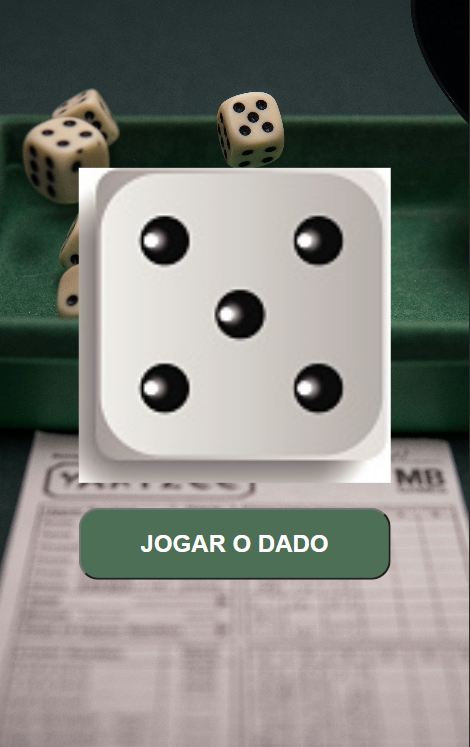

# 📋 Indíce

- [Bem-vindo](#id01)
- [Proposta](#id02)
- [Desafio](#id03)
- [Aprendizado](#id04)
- [Prosseguimento](id05)
- [Screenshots](#id06)
- [Links](#id07)
- [Tecnologias utilizadas](#id08)
- [Pré-requisitos](#id09)
- [Procedimentos de instalação](#id010)
- [Informações](#id011)

# Bem-vindo! 👋 <a name="id01"></a>

**Jogo do Dado**
<br />

## 🚀 Proposta <a name="id02"></a>

Este projeto é um jogo de dado feito através de JavaScript.
<br />

## :trophy: Desafio <a name="#id03"></a>

Trabalhar com o objeto Math para gerar números aleatórios no JavaScript, trabalhar com a manipulação do DOM e utilizar a estrutura Switch Case.

## :trophy: Aprendizado <a name="#id04"></a>

#### Construído com:

<br />

- JavaScript
- Estruturas de controle
- Document Object Model (DOM)
- SASS

## :trophy: Prosseguimento <a name="id05"></a>

- Realizar outros projetos utilizando o React.js

<br />

# :camera_flash: Screenshots <a name="id06"></a>

## :video_camera: Video

<<<<<<< HEAD
=======
https://github.com/RaizaCirne/jogo-dado/assets/109912543/845fbca6-3baf-4f74-8c42-915b5aed67e3

>>>>>>> c20a4df90ed1ba0974ad73588da7cc1cb3727f76
## :desktop_computer: Desktop design


## :iphone: Mobile design



<br />

# :heavy_check_mark: Links <a name="id07"></a>

<br />

- Para acessar o site [Clique aqui](https://jovial-mooncake-077847.netlify.app/)

<br />

# 🛠 Tecnologias utilizadas <a name="id08"></a>

<br />

- JavaScript
- CSS3
- HTML4
- SASS

<br />

# ☑️ Pré-requisitos <a name="id09"></a>

<br />

- [x] Editor de código de sua preferência (recomendado VS code)
- [x] Git

<br />

# 📝 Procedimentos de instalação <a name="id010"></a>

<br />

Clone este repositório usando o comando:

```bash
git clone https://github.com/RaizaCirne/jogo-dado.git
```

Baixar arquivo zip

Extrir arquivos

Abrir pasta no editor de código.

<br />

# :sunglasses: Informações <a name="id011"></a>

<br />

- Personal Page - [Raíza Cirne Braz](https://jovial-mooncake-077847.netlify.app/)
- Frontend Mentor - [@RaizaCirne](https://www.frontendmentor.io/profile/RaizaCirne)
- GitHub - [RaizaCirne](https://github.com/RaizaCirne)
- LinkedIn - [Raíza Cirne Braz](https://www.linkedin.com/in/ra%C3%ADzacirne/)

**JavaScript - CSS3 - HTML5 - SASS** 🚀
